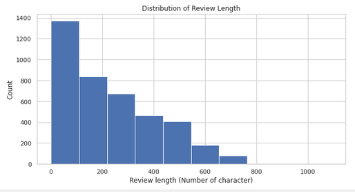

# SENTIMENTAL ANALYSIS ON MAJOR ANTI-HYPERTENNSIVE DRUGS

### 1.1 Objective
The objective of this project is to carry out sentimental analysis on commonly prescribed anti-hypertensive drugs in the united state. Build a web-app that reassure user of these drugs based on review sentiment. Anti hypertensive drugs used are:
- Amlodipine ```Brand names: Norvasc, Katerzia, Norliqva```
- Metoprolol ```Brand names: Metoprolol Succinate ER, Metoprolol Tartrate, Lopressor, Toprol-XL```
- Lisinopril ```Brand names: Zestril, Prinivil, Qbrelis``` 
- Losartan ```Brand names: Cozaar```
- Furosemide ```Brand names: Lasix, Diaqua-2, Lo-Aqua```


### 1.2 Data Source
- The data set used in notebook was scraped from 
    - https://www.drugs.com/
    - https://www.askapatient.com/
- Scraping script can be found <a  href='https://github.com/Sachimugu/Drug-sentiment-analysis./tree/master/Data%20collection'>Here</a>.

### 1.3 Result Peak




### 1.4 Challenges
Challenges faced while getting these review sentitments are:
- Most user are using these drug with combination of other drugs for other co-morbidities.
- Users are on diffrent dosage.
- Druration of use are diffrent for users.
- Some review are sarcastic and  aspected base.
- Most expected side effect are consider as adverse effect by users.

### 1.5 Performance
 Over all, Textbolb sentiment polarity and Nltk sentiment analyser did perform better than Bert.
 
### Contact
<a href="mailto:sachimugu@gmail.com">  </a>
<a href="https://www.linkedin.com/in/achimugu-a-79aa8a18a/">  </a>
<a href="https://twitter.com/achimugu_a">  </a>
<a href="https://medium.com/@sachimugu">  </a>


 


